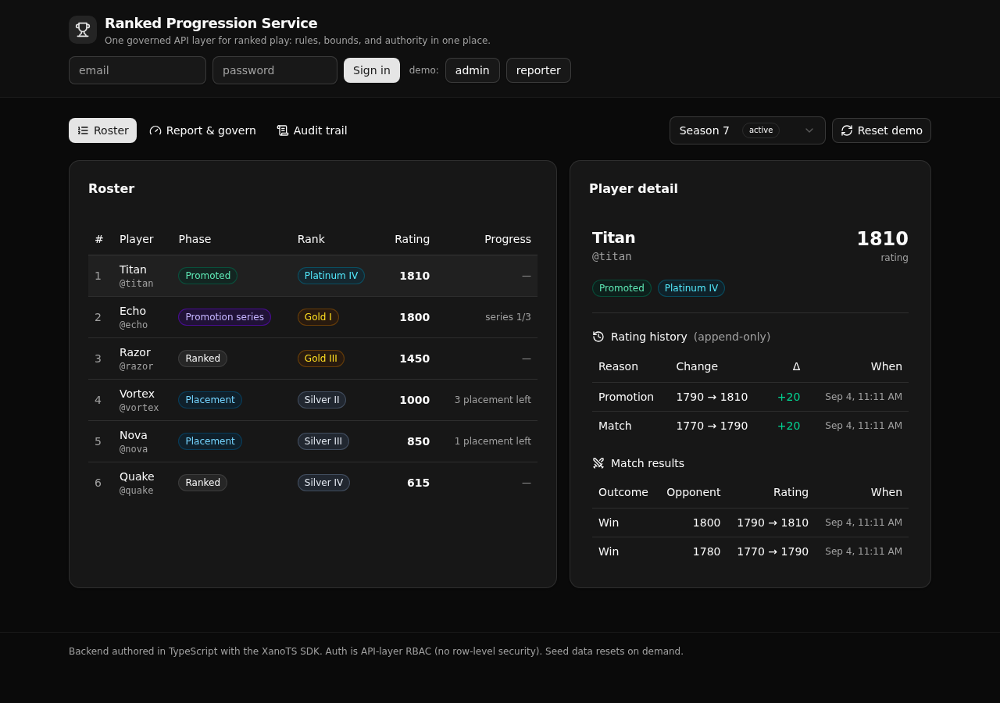

# Ranked Progression Service

A governed ranked-play backend where the ranking rules live in one readable API layer, not scattered across game servers and scripts.

Each player's season is a case that moves through an enforced state machine. Match results recompute rating within governed bounds, illegal transitions are refused at the API layer, and every result and rank change lands in an append-only history. Speed is not the point here. Control is.

**7 tables · 10 endpoints · 2 rating-engine lambdas · API-layer RBAC**



## What it demonstrates

This is a Xano **Backend Modernization** play for a competitive gaming platform. A studio backend engineer replaces the ranking logic that usually lives in a dozen places with one service a technical reviewer can read and trust.

Three things a reviewer can point at:

- **A progression state machine.** A season runs `placement` to `ranked`, then a win at a tier boundary opens a `promotion_series`, which resolves to `promoted` or falls back to `ranked`. A bottom-boundary loss is a `demotion`. The `promoted`, `demoted`, and `closed` phases are terminal, and a further result is refused.
- **Rating math with bounds.** A reported match recomputes rating with an Elo-style step, capped per match, and clamped so it never drops below zero. The math sits in one lambda, next to the explicit guards, so it reads as one governed rule set.
- **Authority in one place.** Auth is API-layer role-based access control (RBAC). A reporter may report a match. Only an admin may override a rating or move a season. The role is read from the staff row on every call, so a client cannot claim admin by editing a token. There is no row-level security.

## Repo layout

```
xano/
├── index.ts               registers the workspace (tables + api group + queries)
├── tables/                staff, players, seasons, ranked_states,
│                          match_results, rating_history, audit_log
├── api/ranked.ts          the api group (canonical slug pinned)
├── api/_guards.ts         the requireAdmin() RBAC guard
├── api/*.ts               the 10 endpoints
├── routes.gen.ts          generated path/verb manifest (imports nothing)
└── xano.lock              pinned object identities (committed)
frontend/
└── src/                   React + Vite + Tailwind + shadcn/ui
    ├── lib/api.ts          the one contract: paths + types from the query defs
    └── components/         Roster, PlayerDetail, GovernView, AuditView
```

## API surface

All endpoints are under `/api:ranked/`.

| Verb | Path | What it enforces |
| --- | --- | --- |
| POST | `/seed` | Resets and loads the demo. Public, so a fresh deploy is browsable. |
| POST | `/login` | Verifies a staff credential, mints a token carrying the role. |
| GET | `/seasons` | Lists seasons with status and dates. |
| GET | `/players` | The roster for one season, with each player's phase, tier, and rating. |
| GET | `/rank/{player_id}` | One player's standing plus their append-only history and matches. |
| POST | `/report` | Recomputes rating within bounds and drives the phase transition. Refuses a terminal phase or a non-active season. Any signed-in staff. |
| POST | `/advance` | Moves a season upcoming to active. Refuses an illegal move. Admin only. |
| POST | `/close` | Moves a season active to closed and closes its states. Admin only. |
| POST | `/override` | The one sanctioned bypass: forces a rating or phase, and records it. Admin only. |
| GET | `/audit` | The append-only trail of every governed action. Admin only. |

The frontend never hand-types a URL or a request body. It reads paths from the generated `routes.gen.ts` and derives request and response types from the query defs with `InferInput` and `InferResponse`, so a change to a def flows straight into the UI. The XanoTS runtime stays out of the browser bundle.

## Quick start

Clone it and get a live, governed backend in about a minute.

```bash
git clone https://github.com/xano-scratch/ranked-progression-service
cd ranked-progression-service
npm install
npx xanots login          # one-time auth with your Xano instance
npm run xano:deploy       # builds the frontend, deploys, prints the live URL
```

Open the printed URL. The app loads its demo data on first visit, so you land on a full roster, not an empty shell. Sign in with the demo accounts:

- `admin@arena.gg` / `admin-pass-2026` (admin)
- `reporter@arena.gg` / `reporter-pass-2026` (reporter)

Report a match and watch the rating and phase move. Try an admin action as the reporter and watch the API refuse it.

## FAQ

**Is this row-level security?** No. Xano models access at the API layer with middleware and role checks. Every protected endpoint reads the caller's role from the staff row and refuses the request when it does not match. That is the RBAC pattern, not RLS.

**Where does the rating math live?** In one lambda per write endpoint, next to the explicit `s.precondition` guards. The guards (role, active season, terminal phase) stay visible in the stack, and the math stays in one place a reviewer can read.

**Can I reset the demo?** Yes. The Reset button calls `POST /api:ranked/seed`, which truncates the tables and reloads the fixture spread across every phase.

**Is this a production reference?** No. It is an example backend built to show the pattern. The live links are ephemeral. Deploy your own for fresh ones.
